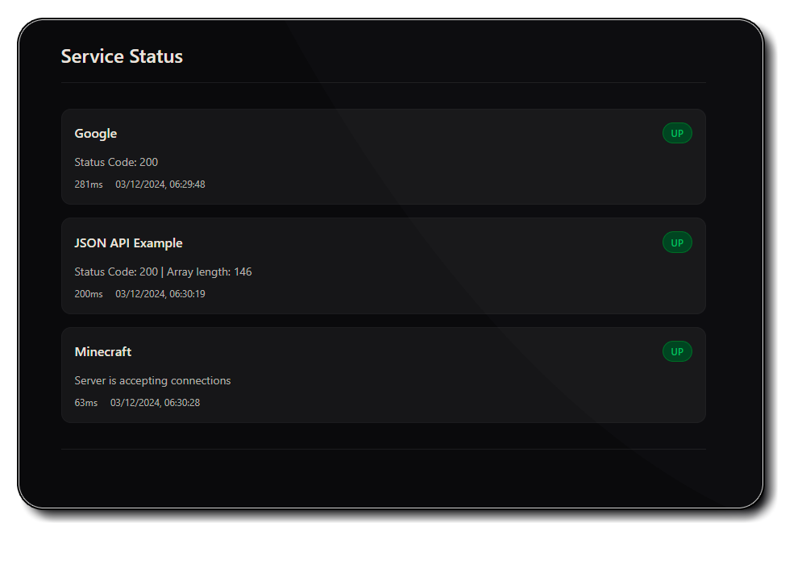

# Status Monitor🚦

Simple service monitoring with a status page, configurable and extensible protocols and notifications.



## Table of Contents 📑
- [Features](#features-)
- [Configuration](#configuration-)
- [Protocols](#protocols-)
  - [HTTP](#http-)
  - [HTTP-JSON](#http-json-)
  - [Minecraft](#minecraft-)
  - [Call of Duty](#call-of-duty-)
- [Notifiers](#notifiers-)
  - [Discord Webhook](#discord-webhook-)
  - [Discord](#discord-)
  - [Telegram](#telegram-)
  - [Webhook](#webhook-)
- [Extending](#extending-)
  - [Custom Protocols](#custom-protocols)
  - [Custom Notifiers](#custom-notifiers)
- [API](#api-)

## Features 🚀
- Extensible monitoring protocols & notifications
- Status page
- REST API for status data

## Configuration 🛠

`config.json` structure:

```json
{
    "port": 3000,
    "checkInterval": 30,
    "globalNotifications": [
        {
            "type": "notifier-name",
            "trigger": "change",
            "config": {}
        }
    ],
    "watchers": [
        {
            "name": "Service Name",
            "protocol": "protocol-name",
            "checkInterval": 60,
            "url": "https://example.com",
            "hidden": false,
            "failThreshold": 3,
            "notifications": []
        }
    ]
}
```

## API 📡

### GET /api/status
Returns current status of all services.

```json
{
    "timestamp": "2024-03-12T12:34:56.789Z",
    "services": [
        {
            "name": "Service Name",
            "status": "up",
            "responseTime": 123,
            "lastChecked": "2024-03-12T12:34:56.789Z",
            "message": "Status message"
        }
    ]
}
```

## Protocols 📡

### HTTP 🌐

Checks if the response status code is in the allowed list.
```json
{
    "name": "Example HTTP watcher",
    "protocol": "http",
    "checkInterval": 60,
    "url": "https://example.com",
    "timeout": 5000,
    "allowedStatusCodes": [200, 201, 204],
    "notifications": []
}
```

### HTTP-JSON 📄

Checks if the response is valid JSON and if the specified JSON path exists.
```json
{
    "name": "Example JSON API watcher",
    "protocol": "http-json",
    "checkInterval": 15,
    "url": "https://example.com/api",
    "jsonPath": "data.status",
    "timeout": 5000,
    "allowedStatusCodes": [200, 201, 204],
    "condition": {
        "type": "equals",
        "value": "online"
    },
    "notifications": []
}
```

Checks if the JSON path exists and is an array with at least one element.
```json
"jsonPath": "data.statuses",
"condition": {
    "type": "array-length",
    "min": 1
}
```

### Minecraft 🎮

Minecraft Java Edition, verifies server handshake.
```json
{
    "name": "Example Minecraft watcher",
    "protocol": "minecraft",
    "checkInterval": 60,
    "host": "mc.example.com",
    "port": 25565,
    "timeout": 5000,
    "notifications": []
}
```

### Call of Duty 🎮

DPMaster compatible Call of Duty servers (IW4x, CoD4 etc). Sends `getInfo` packet and waits for `infoResponse`.

```json
{
    "name": "Example CoD Server",
    "protocol": "cod",
    "checkInterval": 60,
    "host": "example.com",
    "port": 28960,
    "timeout": 5000,
    "notifications": []
}
```

## Notifiers 📤

### Discord Webhook 📨

Sends a message to a Discord webhook.
```json
{
    "type": "discord-webhook",
    "webhookUrl": "<discord-webhook-url>"
}
```

### Discord 📨

Sends a message to a Discord channel.
```json
{
    "type": "discord",
    "botToken": "<discord-bot-token>",
    "channelId": "<discord-channel-id>"
}
```

### Telegram 📨

Sends a message to a Telegram chat.
```json
{
    "type": "telegram",
    "botToken": "<telegram-bot-token>",
    "chatId": "<telegram-chat-id>"
}
```

### Webhook 📨

Sends a message to a webhook.
```json
{
    "type": "webhook",
    "url": "<webhook-url>"
}
```

## Extending 🔧

### Custom Protocols
Create new files in the `protocols/` directory. See existing protocols for reference.

Each protocol must export:
- `name`: Protocol identifier used in config
- `check(watcher)`: Async function returning status object

### Custom Notifiers
Create new files in the `notifiers/` directory. See existing notifiers for reference.

Each notifier must export:
- `name`: Notifier identifier used in config
- `notify(changes, config)`: Async function to send notifications
